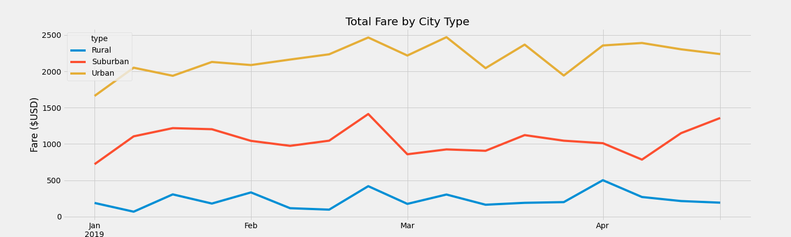

# PyBer_Analysis

## Overview
The overall goal of this project was to use the ride share data and gather information on the rides per type of city(rural, suburban, and urban). In other words, we wanted to see which types of cities gained the most traffic, the amount of drivers in the areas, the average ride fair per ride, total fares and other like information.

## Results
### Results off City Type
* 
* As you can see in the graph above, Urban areas account for most of the rides, amount of drivers and total fares. It makes sense because urban areas are typically the busiest and the demand for rides is high.
* There are much less rides in rural areas, but the average fare per ride is higher than the other two city types. Because Rural areas are more spread out, the average trip must be longer than most, which makes sense as to why the average fare is higher.
* Suburban areas are in the middle compared to rural and urban areas. Suburban cities have more rides than rural areas, but the rides are still more expensive on average than the ones in urban areas.

###Total Fare By City Type

* In this graph above, we can see the ammount of fares generated per city type. As stated earlier, urban areas make up most of the total fares followed by suburban areas and then rural.
* This graph also shows Fares in comparison to the month of the year. This can help us determine which months are the most profitable.

## Summary

### 3 Business Reccomendations
1. The first reccomendation I would make would be to incentivise drivers to drive in more urban areas. Urban areas make up 62.72% of the income earned from the fares. Most of the money for these rideshare companies are generated in urban areas. If drivers could be promised more money on trips in these areas, the demand will constantly be met and more rides can be given per day.
2. My second reccomendation would be to also give drivers a reason to go to rural and suburban places. As stated in my first reccomendation, drivers in urban areas is a priority. However, we need to still give riders in rural and suburban areas drivers available. My suggestion would be to give drivers who live in rural and suburban area a weekly challenge to give a certain amount of rides in the city they live in. That way drivers will still want to stay local but also have the option to drive anywhere.
3. My last suggestion would be to start advertising and announcing deals for mid to late February. In our Total fares by city type graph, fares all spike around this time of year. If you can start advertising for this time of the year, I believe you will see an even more profitable end of the month then in years passed.